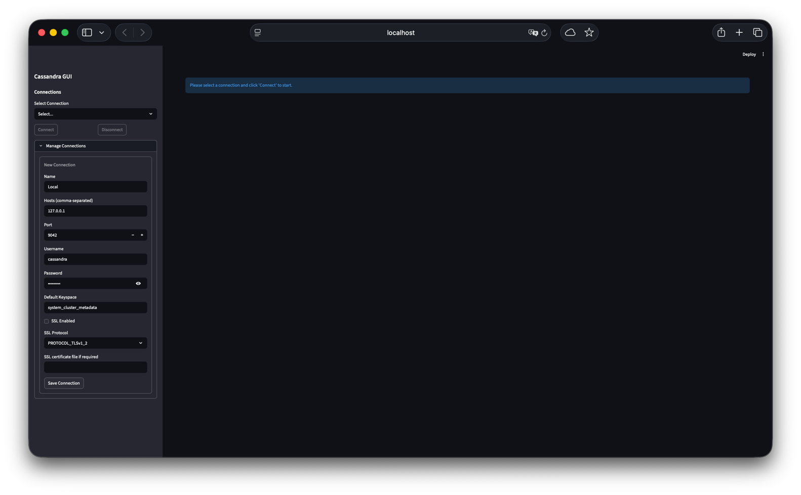

This tutorial provides a walkthrough of **kassandra**, a streamlined GUI designed to make managing Apache Cassandra clusters 
as painless as possible. From configuring SSL connections to handling complex map types, here is how to get the most out 
of the tool.

---

# Quick Introduction

## 1. Launch Cassandra Using Docker
```bash
docker run -d --name cassandra --hostname cassandra --network cassandra -p 9042:9042 cassandra
```

## 2. Launch kassandra

```bash
docker run --name kassandra --rm \
  --env KASSANDRA_HOME=/etc/kassandra --volume "/path/to/local/.kassandra:/etc/kassandra" \
  -p 8501:8501 kassandra:latest
```
---

## 3. Setting Up Your Connection

Before you can query data, you need to tell kassandra where your cluster lives.

1. Open the **Manage Connections** section in the sidebar.
2. Click to edit or create a new connection.
3. **Fill in the details:**
   * **Hosts:** Enter your node IPs (e.g., `127.0.0.1`).
   * **Port:** Default is usually `9042`.
   * **Authentication:** Provide your `Username` and `Password` (_cassandra_ and _cassandra_).
   * **SSL:** If your cluster requires encryption, check **SSL Enabled** and select your protocol 
   (e.g., `PROTOCOL_TLSv1_2`). You can also upload a certificate file if needed.
4. Click **Save Connection**.

Connect to the local Cassandra


## 4. Connecting and Schema Navigation

Once saved, your connection will appear in the **Select Connection** dropdown.

* **Connect:** Click this to initialize the driver. Once successful, the sidebar will populate with a **Schema** section.
* **Schema Exploration:** Use the **Keyspace** and **Table** dropdowns to navigate through your database. 
  If you’ve just made changes via CQL, hit the **Refresh** button to update the list.


## 5. Using the CQL Editor

For heavy lifting like schema creation or complex joins, use the built-in **CQL Editor**.

* **Executing Queries:** Type your commands (e.g., `CREATE KEYSPACE` or `INSERT INTO`) and click **Execute Query**.
* **Feedback:** The UI provides a green success alert for valid commands and a blue notification specifying if rows 
were returned or if it was a schema-only change.

```sql
-- Example: Creating a shop keyspace
CREATE KEYSPACE demo_shop 
WITH replication = {
  'class': 'SimpleStrategy', 
  'replication_factor': 1
};
```


## 6. Browsing and Filtering Data

When you select a table from the sidebar, the **Data Browser** tab opens automatically.

* **Filtering:** kassandra generates dynamic filters based on your table columns (e.g., `price`, `product_id`, `name`). Enter values to narrow down your results.
* **Pagination:** Adjust the **Rows per page** at the bottom to manage large datasets.
---

# Demo Keyspace: `demo_shop`

## Create Keyspace

```sql
CREATE KEYSPACE demo_shop
WITH replication = {
  'class': 'SimpleStrategy',
  'replication_factor': 1
};
```

## Table 1: users

Good for:

* Filtering by partition key
* Map column demo
* Insert form demo

```sql
CREATE TABLE demo_shop.users (
    user_id UUID,
    email TEXT,
    full_name TEXT,
    country TEXT,
    created_at TIMESTAMP,
    profile MAP<TEXT, TEXT>,
    PRIMARY KEY (user_id)
);
```

### Sample Data

```sql
INSERT INTO demo_shop.users (user_id, email, full_name, country, created_at, profile)
VALUES (
  uuid(),
  'john@example.com',
  'John Carter',
  'USA',
  toTimestamp(now()),
  {'role': 'admin', 'tier': 'gold'}
);

INSERT INTO demo_shop.users (user_id, email, full_name, country, created_at, profile)
VALUES (
  uuid(),
  'sara@example.com',
  'Sara Smith',
  'Canada',
  toTimestamp(now()),
  {'role': 'user', 'tier': 'silver'}
);

INSERT INTO demo_shop.users (user_id, email, full_name, country, created_at, profile)
VALUES (
  uuid(),
  'ali@example.com',
  'Ali Reza',
  'Germany',
  toTimestamp(now()),
  {'role': 'user', 'tier': 'bronze'}
);
```


Great for:

* Showing map schema editor (`profile`)
* Filtering by `country`
* Extended result mode

### Table 2: products

Good for:

* Simple browsing
* Numeric fields
* Stock updates

```sql
CREATE TABLE demo_shop.products (
    product_id UUID,
    name TEXT,
    category TEXT,
    price DECIMAL,
    stock INT,
    attributes MAP<TEXT, TEXT>,
    PRIMARY KEY (product_id)
);
```

### Sample Data

```sql
INSERT INTO demo_shop.products (product_id, name, category, price, stock, attributes)
VALUES (
  uuid(),
  'Mechanical Keyboard',
  'Electronics',
  129.99,
  45,
  {'switch': 'brown', 'layout': 'ANSI'}
);

INSERT INTO demo_shop.products (product_id, name, category, price, stock, attributes)
VALUES (
  uuid(),
  'Noise Cancelling Headphones',
  'Electronics',
  299.99,
  12,
  {'wireless': 'yes', 'battery': '30h'}
);

INSERT INTO demo_shop.products (product_id, name, category, price, stock, attributes)
VALUES (
  uuid(),
  'Standing Desk',
  'Furniture',
  499.00,
  7,
  {'material': 'bamboo', 'motor': 'dual'}
);
```
 Demo ideas:

* Update stock
* Show map editing
* Run price filter queries

### Table 3: orders (Partition + Clustering Demo)

This is perfect to demonstrate:

* Partition keys
* Clustering columns
* Paging through wide rows

```sql
CREATE TABLE demo_shop.orders (
    user_id UUID,
    order_id TIMEUUID,
    order_date TIMESTAMP,
    total DECIMAL,
    status TEXT,
    PRIMARY KEY (user_id, order_id)
) WITH CLUSTERING ORDER BY (order_id DESC);
```


### Insert Sample Orders

⚠️ First grab a user_id:

```sql
SELECT user_id FROM demo_shop.users;
```

Then insert:

```sql
INSERT INTO demo_shop.orders (user_id, order_id, order_date, total, status)
VALUES (
  9661deb5-c656-4387-8fa7-df274f13d502,
  now(),
  toTimestamp(now()),
  249.99,
  'SHIPPED'
);

INSERT INTO demo_shop.orders (user_id, order_id, order_date, total, status)
VALUES (
  9661deb5-c656-4387-8fa7-df274f13d502,
  now(),
  toTimestamp(now()),
  89.50,
  'PENDING'
);

INSERT INTO demo_shop.orders (user_id, order_id, order_date, total, status)
VALUES (
  9661deb5-c656-4387-8fa7-df274f13d502,
  now(),
  toTimestamp(now()),
  540.00,
  'DELIVERED'
);
```
 Perfect for:

* Demonstrating filtering by partition key
* Showing descending clustering order
* Extended CQL mode
