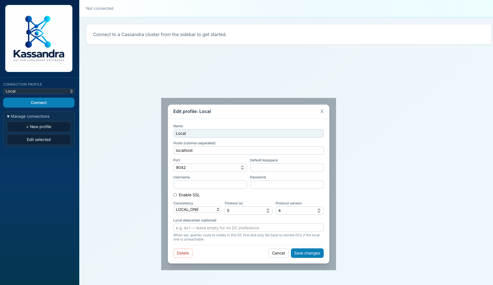
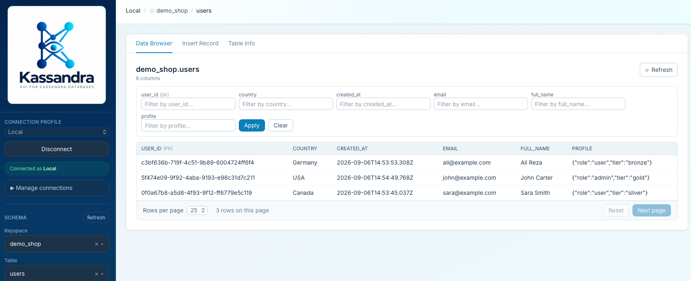
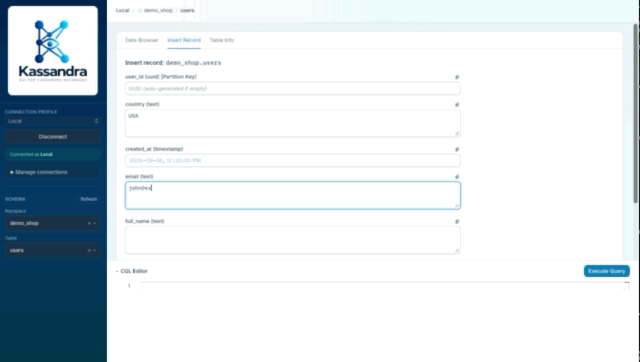

# Kassandra: Quick Start

## Overview

Kassandra is a web-based graphical client for Apache Cassandra clusters. The current application uses a React and TypeScript frontend with a Node.js, Express, and TypeScript backend. It lets you browse data and schemas, manage connection profiles, generate CQL from forms, and execute queries.

The previous Python/Streamlit implementation is kept in [`legacy/`](../legacy) for reference. Python, uv, and Streamlit are no longer needed to run the current application.

## Features

- **Connection management**: Create, edit, and delete profiles with authentication, SSL, and optional local datacenter selection.
- **Schema explorer**: Search keyspaces and tables, refresh schema lists, and favorite keyspaces.
- **Data browser**: Browse paginated rows, apply column filters, and inspect individual records.
- **Schema-driven forms**: Generate INSERT and UPDATE statements for review and execution in the CQL editor.
- **Record deletion**: Delete a selected row after confirmation.
- **CQL editor**: Write queries with syntax highlighting and completion, execute them, and page through results.
- **Column customization**: Configure hidden columns, JSON and enum fields, and map schemas.

## Installation

### Prerequisites

- Node.js 26 or newer and npm for running from source.
- A running Cassandra cluster reachable from the Kassandra server.
- Docker if you prefer running the application in a container.

### Run from source

1. Clone the repository and install dependencies:

   ```bash
   git clone https://github.com/irajhedayati/kassandra.git
   cd kassandra
   npm install
   ```

2. Build the application and start it:

   ```bash
   npm run build
   npm start
   ```

3. Open [http://127.0.0.1:8501](http://127.0.0.1:8501). Express serves both the API and the built React application on this port.

For development, run `npm run dev` instead and open [http://localhost:5173](http://localhost:5173). This starts the Vite frontend on port 5173 and the API server on port 8501; Vite proxies `/api` requests to the server.

### Docker

From the cloned repository, build and run the image:

```bash
docker build -t kassandra .
docker run --name kassandra --rm \
  --env KASSANDRA_HOME=/etc/kassandra \
  --volume "/path/to/local/.kassandra:/etc/kassandra" \
  -p 8501:8501 kassandra
```

Replace `/path/to/local/.kassandra` with the host directory where you want to persist settings, then open [http://localhost:8501](http://localhost:8501).

Connection hosts must be reachable from inside the container. For Cassandra running on your host with Docker Desktop, use `host.docker.internal`; for another container on the same Docker network, use its container name. Certificate paths must also be accessible inside the Kassandra container.

## User Guide

### 1. Connection Management

#### Creating a new connection

1. Expand **Manage connections** in the sidebar and click **+ New profile**.
2. Fill in the connection details:
   - **Name**: A friendly name for the profile.
   - **Hosts (comma-separated)**: Node IP addresses or hostnames, such as `127.0.0.1`.
   - **Port**: Cassandra native protocol port, usually `9042`.
   - **Default keyspace**: Optional initial keyspace.
   - **Username / Password**: Credentials if authentication is required.
   - **Enable SSL**: Enable this for encrypted connections, then choose an **SSL protocol** and optionally provide an **SSL cert path** on the server filesystem.
   - **Consistency**, **Timeout (s)**, and **Protocol version**: Adjust to match your cluster.
   - **Local datacenter (optional)**: Enter a cluster datacenter name to prefer nodes in that datacenter. Leave empty for no datacenter preference. An unknown name produces a connection error listing available datacenters.
3. Click **Create**.



#### Connecting and managing profiles

1. Select a saved profile from **Connection profile** in the sidebar.
2. Click **Connect**. The connection status and **Schema** section appear when connected.
3. To switch profiles or edit the selected profile, click **Disconnect** first.
4. Under **Manage connections**, click **Edit selected** to change settings and **Save changes** to persist them. The dialog also provides **Delete**, with confirmation, to remove the profile.

### 2. Browsing Data

1. In the sidebar's **Schema** section, search for or select a **Keyspace**, then a **Table**.
2. Open the **Data Browser** tab to view rows.
3. Use the sidebar's **Refresh** button to reload schema lists after schema changes.

Click the star beside the selected keyspace in the top bar to add or remove it from favorites. Favorites are saved per connection profile and appear first in the keyspace selector.



#### Data grid controls

- **Filtering**: Enter values in the column fields above the grid, then click **Apply**. Click **Clear** to remove filters. These are equality filters; the generated query uses `ALLOW FILTERING`, which can scan substantial data for non-key columns.
- **Pagination**: Choose 10, 25, or 50 **Rows per page**. Use **Next page** to continue and **Reset** to return to the first page.
- **Refresh**: The button above the grid reloads the current page and its schema and metadata.
- **Selection**: Click a row to open its details dialog. Primary and clustering key columns are marked `(pk)` and `(ck)` in the grid.

### 3. Inserting, Updating, and Deleting Records

#### Inserting records

1. Open the **Insert Record** tab.
2. Fill in the form generated from the table schema. It provides type-specific fields, including collection editors for maps, lists, and sets.
3. Provide the primary key values. Empty fields are omitted from the generated INSERT; for generated identifiers, you can use `uuid()` or `now()` in the CQL editor for UUID or TIMEUUID columns respectively.
4. Click **Generate CQL** to send the INSERT statement to the editor below.
5. Review or edit the statement, then click **Execute Query** to insert the record.
6. Return to **Data Browser** and click **Refresh** to see the result.



#### Updating records

1. Click a row in **Data Browser** to open its details dialog.
2. Click **Edit** and change the desired values. Primary key fields are read-only.
3. Click **Generate CQL** to send the changes to the CQL editor.
4. Review the generated statements and click **Execute Query** to apply them.
5. Refresh the data browser to see the updated row.

Generating CQL does not write to Cassandra; inserts and updates take effect when you execute the generated query.

#### Deleting records

1. Click a row in **Data Browser**.
2. Click **Delete** in the details dialog.
3. Confirm the deletion. This deletes the record directly and refreshes the data browser.

### 4. CQL Editor

The **CQL Editor** is a collapsible panel at the bottom of the application, available whenever a connection is active. You can use it before selecting a table, including to create keyspaces or tables.

1. Click the **CQL Editor** heading to expand it if collapsed.
2. Enter a query, using a fully qualified table name when needed:

   ```sql
   SELECT * FROM demo_shop.users LIMIT 25;
   ```

3. Click **Execute Query**, or press **Cmd+Enter** on macOS / **Ctrl+Enter** on Windows and Linux.
4. Read the returned rows in the results table, or the success or error message for the statement. Use **Next page** when more results are available.


### 5. Table Info

The **Table Info** tab displays column names, CQL types, and partition and clustering key information. It also lets you customize how Kassandra displays and edits columns:

- **Hide**: Exclude a column from the data browser.
- **Text fields**: Choose `text`, `JSON`, or `enum` presentation. For enums, enter the allowed values as a comma-separated list.
- **Map Schema**: Configure map entries for the map form editor.

Click **Save** to persist these settings, or **Cancel** to discard pending changes. These settings customize Kassandra's interface; they do not alter the Cassandra table schema.

## Configuration

Connection profiles, column metadata, and favorite keyspaces are stored on the server in `~/.kassandra/config.json`. Set `KASSANDRA_HOME` to use a different directory. The Node.js application reads the existing configuration format and fills missing profile fields with defaults.

For source installations, `HOST` and `PORT` control the server's listening address and port; defaults are `127.0.0.1` and `8501`. The Docker image sets `HOST=0.0.0.0` so the published port is reachable.

See the [demo walkthrough](demo.md) for sample keyspaces, tables, and CQL data used in the screenshots.
